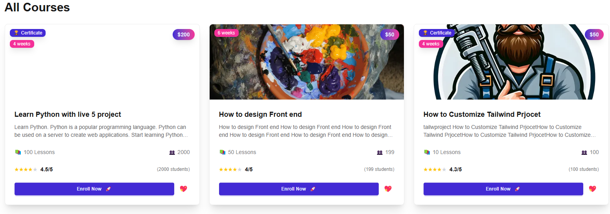
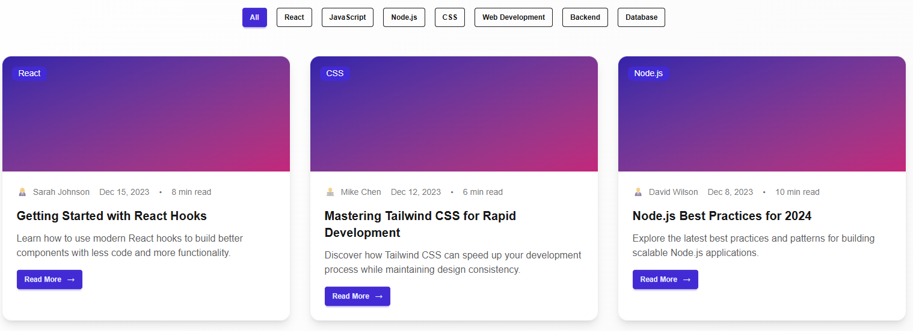

# 📚 Course Hub - Online Learning Platform


Transform your skills with expert-led courses - A modern, interactive platform for learners and instructors.

---

## 🚀 Live Demo
[Visit Course Hub](#)
https://couse-hub-nextjs.vercel.app/
---

## 📖 About The Project
Course Hub is a full-stack online course marketplace built with modern web technologies. It provides a seamless learning experience for students and a powerful platform for instructors to share their knowledge.

---

## ✨ Key Features
- 🎓 **Course Marketplace** - Browse and purchase high-quality courses  
- 👨‍🏫 **Instructor Dashboard** - Create and manage courses with ease  
- 📱 **Responsive Design** - Optimized for all devices  
- 🔐 **Secure Authentication** - Protected user accounts and payments  
- ⭐ **User Reviews & Ratings** - Make informed decisions  
- 📚 **Progress Tracking** - Monitor your learning journey  

---

## 🛠️ Built With

**Frontend**
- Next.js 16 - React framework with App Router  
- React 19 - Latest React features  
- DaisyUI - Tailwind CSS component library  
- React Icons - Beautiful icons  
- Swiper - Touch slider for course carousels  

**Backend**
- Next.js API Routes - Full-stack capabilities  
- MongoDB - NoSQL database  
- Next-Auth - Authentication system  
- BcryptJS - Password hashing  

**UI/UX**
- SweetAlert2 - Beautiful alert modals  
- React Icons - Comprehensive icon library  

---

## 🎯 Screenshots
  
  
Modern and intuitive user interface.

---

## 📦 Installation

### Prerequisites
- Node.js (v18 or higher)  
- MongoDB database  
- npm or yarn  

### Setup Instructions
1. Clone the repository:
    ```bash
    git clone https://github.com/your-username/course-hub.git
    cd course-hub
    ```
2. Install dependencies:
    ```bash
    npm install
    ```
3. Environment Setup: Create a `.env.local` file and add:
    ```env
    MONGODB_URI=your_mongodb_connection_string
    NEXTAUTH_SECRET=your_nextauth_secret
    NEXTAUTH_URL=http://localhost:3000
    ```
4. Run the development server:
    ```bash
    npm run dev
    ```
5. Open your browser at [http://localhost:3000](http://localhost:3000)

---

## 🏗️ Project Structure

---

## 💡 Features Overview

**For Students**
- 🔍 Browse and search courses  
- 📚 Enroll in courses  
- 📊 Track learning progress  
- ⭐ Rate and review courses  
- 💝 Wishlist favorite courses  

**For Instructors**
- 🎬 Create and upload courses  
- 📈 Monitor course performance  
- 💰 Revenue tracking  
- 👥 Student management  
- 🏆 Build teaching reputation  

---

## 🚀 Deployment
This project is deployed on Vercel. To deploy:
1. Push your code to GitHub  
2. Connect your repository to Vercel  
3. Add environment variables in Vercel dashboard  
4. Deploy automatically on git push  

---

## 🤝 Contributing
We welcome contributions!  

1. Fork the project  
2. Create your feature branch (`git checkout -b feature/AmazingFeature`)  
3. Commit your changes (`git commit -m 'Add some AmazingFeature'`)  
4. Push to the branch (`git push origin feature/AmazingFeature`)  
5. Open a Pull Request  

---

## 📄 License
This project is licensed under the MIT License - see the LICENSE.md file for details.

---

## 👥 Authors
**Your Name** - Initial work - [YourUsername](#)

---

## 🙏 Acknowledgments
- Icons by React Icons  
- UI Components by DaisyUI  
- Authentication by Next-Auth  

---

<div align="center">
Ready to start learning?  
[Visit Course Hub](#) • Expand Your Knowledge Today!  

⭐ Star this repo if you find it helpful!
</div>
